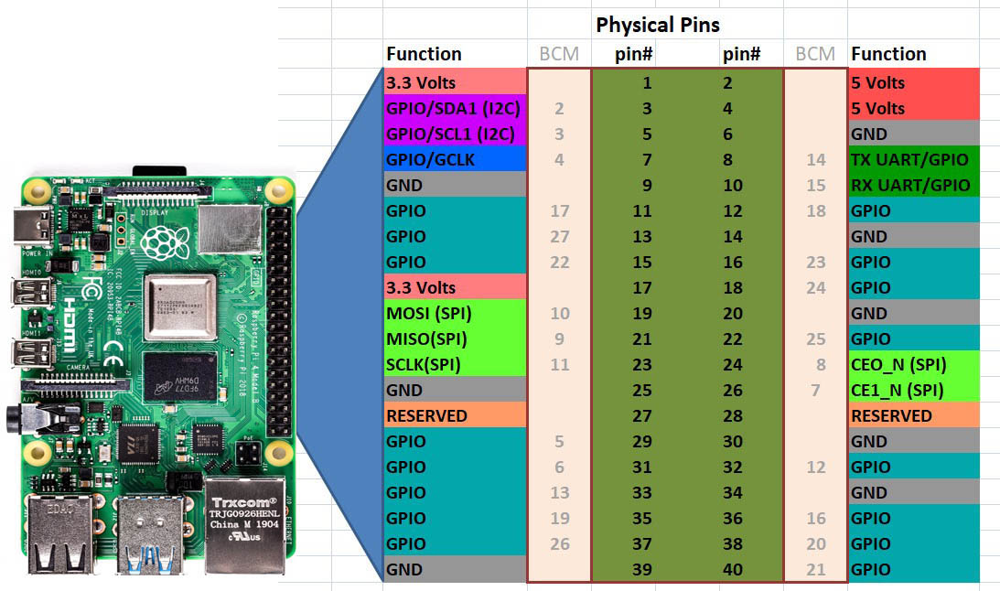

# pigpio-installer

## Aims and Purpose 

### To make installation of all header files required easy  without al the fuss and headaches 

### 🚀 Menu Options

- Install pigpio locally - For when you're running directly on a Raspberry Pi
- Install pigpio on remote Raspberry Pi - For headless Pi installation from your host PC
- Exit - Clean exit from the program

## Pin Outs of the RPI 4 and mapping 


### For a more indepth  understanding of BCM pin mapping see below



###  🚀 Smart Features

- Color-coded output for better readability
- Interactive prompts for remote connection details
- Raspberry Pi detection for local installation (with override option)
- SSH connectivity testing before attempting remote installation
- Error handling with graceful returns to menu
- Automatic cleanup of temporary files
- Progress indicators throughout the proces
  
### Usage


📌 Easy installer for [pigpio](http://abyz.me.uk/rpi/pigpio/) on Raspberry Pi OS / Debian 12.  
Works in **local mode** (run directly on a Pi) or **remote mode** (install over SSH from a host PC).

---

##  Quick Start

### Local install (run on Raspberry Pi):
```bash
curl -sSL https://raw.githubusercontent.com/<yourname>/pigpio-installer/main/install_pigpio.sh | bash
``` 

### What this script does and steps this initiates 

- Installs dependencies
- packages this installs are  git build-essential cmake pkg-config

### Prepares and clones GPIO Repos for Lib's required CPP and Python developments 

 - Cleans  up any existing pigpio directory remote or local
 - git clones https://github.com/joan2937/pigpio.git
  
### Builds and installs from source

### Installs any additional packages for safe measure 

-  These are as follows 


    - libpigpiod-if-dev (development headers)..."
    - Checks for  libpigpiod-if2 variants  .. "
    - Checks for libpigpiod-if2 (client library interface)..."
    - Installs  pigpio-tools (command-line tools)..."
    - Installs python3-pigpio (Python binding)..."

### Enable and start the daemon for remote GPIO usage 

- Tests to see  if daemon running on remote machine 
- Checks if pigpiod is listening on default port 8888 
  
### Finally tells you how to use this  from command line 

- Quick test commands:" 
- Try: pigs t 17"
-  Refer to the diag outlining the ports and here is a diagram showing you how  to connect a simple led via resistors  to your gpio ports 


